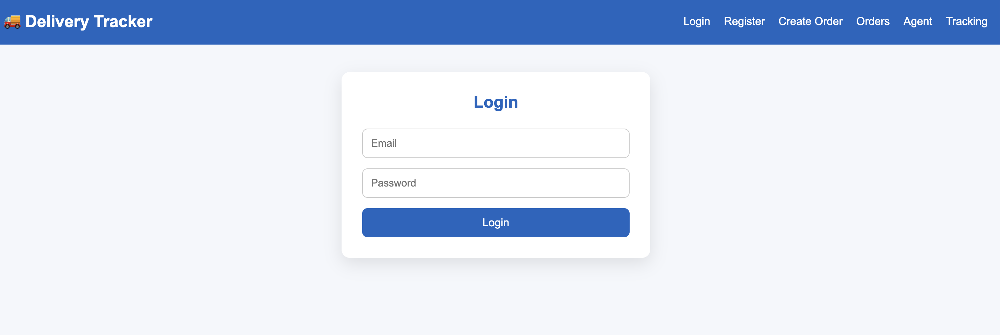
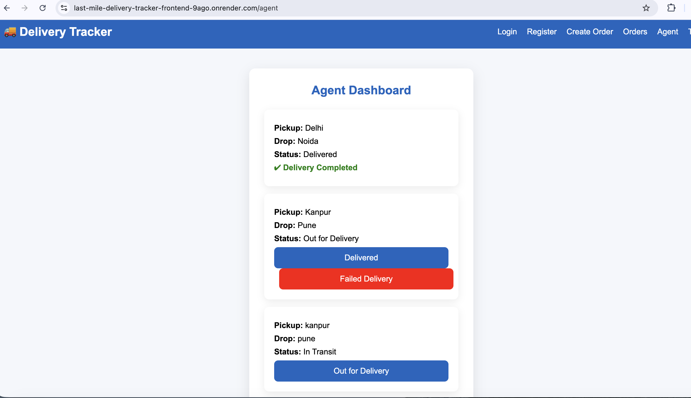
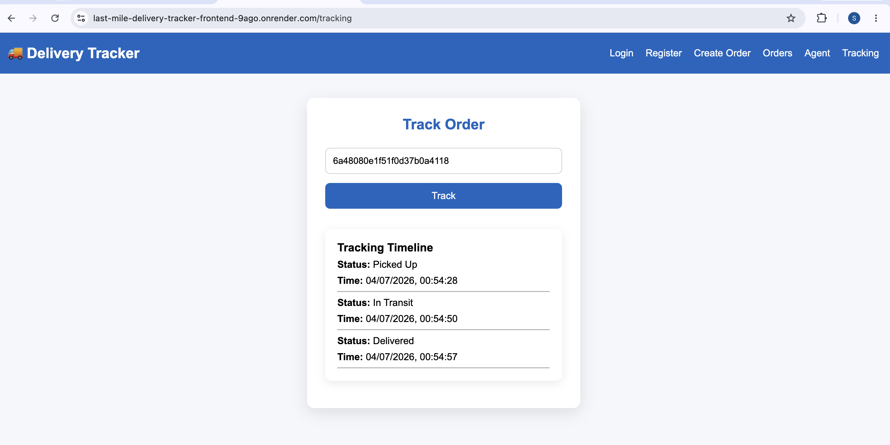

# Last-Mile-Delivery-Tracker
Application url : https://last-mile-delivery-tracker-frontend-9ago.onrender.com
# Project Overview
This is a MERN Stack web application for managing last-mile delivery orders. It allows users to create orders, assign delivery agents, track order status, and calculate delivery charges based on weight and distance.

## Tech Stack
- Frontend: React.js
- Backend: Node.js, Express.js
- Database: MongoDB
- Version Control: Git & GitHub

## Setup Guide

1. Clone the repository
```bash
git clone <repository-url>
```

2. Install dependencies

Backend
```bash
cd backend
npm install
```

Frontend
```bash
cd frontend
npm install
```

3. Create a `.env` file using `.env.example`.

4. Start the backend

```bash
npm start
```

5. Start the frontend

```bash
npm run dev
```

---

## .env.example

Create a `.env` file in the backend with:

```env
PORT=5000
MONGODB_URI=your_mongodb_connection_string
JWT_SECRET=your_secret_key
```

---

## API Documentation

### User APIs
- POST `/api/users/register` - Register a user
- POST `/api/users/login` - Login

### Order APIs
- POST `/api/orders/create` - Create a new order
- GET `/api/orders` - Get all orders
- GET `/api/orders/:id` - Get order details

### Tracking APIs
- PUT `/api/tracking/update` - Update order status
- GET `/api/tracking/:id` - Track an order

---

## Database Schema

### User
- name
- email
- password
- role

### Order
- customer
- pickupAddress
- dropAddress
- actualWeight
- volumetricWeight
- chargeableWeight
- orderType
- paymentType
- assignedAgent
- deliveryCharge
- status

### Tracking
- orderId
- status
- updatedAt

---

## Rate Calculation Logic

1. Calculate Volumetric Weight

```
(length × breadth × height) / 5000
```

2. Chargeable Weight

```
Maximum(actualWeight, volumetricWeight)
```

3. Delivery Charge

```
Base Charge + (Chargeable Weight × Rate per kg)
```

The application automatically calculates the chargeable weight and delivery charge while creating an order.              

## System Design

The Last Mile Delivery Tracker uses a **zone-based delivery system** to automate order assignment and tracking.

### Zone Detection
- Pickup and drop addresses are mapped to predefined delivery zones.
- Zones help organize deliveries and reduce travel time.

### Auto-Assignment Logic
- The system automatically finds an available delivery agent in the pickup zone.
- The selected agent is assigned to the order.
- Order status changes to **Assigned**, and a tracking record is created.

### Failed Delivery Handling
- If delivery fails, the order status is updated to **Failed Delivery**.
- The failure reason is stored in the tracking history.
- Admins can review failed orders and reassign or reschedule them if needed.

### Benefits
- Automated agent assignment
- Faster deliveries through zone-based allocation
- Transparent delivery tracking
- Scalable architecture for future enhancements

## Screenshots



